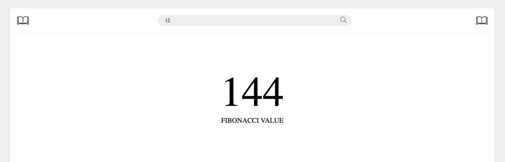

# Fibonacci Calculator

> A calculator to get the fibonacci value based on the position provided. 

    

## Built With

- [create-react-app](https://create-react-app.dev/)
- [React](https://reactjs.org/)
- [Redux](https://redux.js.org/)

## Getting Started

To get a local copy up and running follow these simple steps.

### Prerequisites

- This app works with a fibonacci API. You need to have up and running [this API.](https://github.com/fivan18/rails-api-template) Rest assured you are in the fibonacci branch.

- Make sure you have installed [Node JS](https://nodejs.org/en/). If not, follow this [guide](https://www.geeksforgeeks.org/installation-of-node-js-on-linux/) for Linux or this [one](https://treehouse.github.io/installation-guides/mac/node-mac.html) for Mac OS.

### Download the project

    $ git clone https://github.com/fivan18/books-catalogue.git

### Install the dependencies

Go to the project's root directory and run:

    $ npm install

### Run the project

To modify the code and see the changes on live go to the project's root directory and run:

    $ npm start

### Usage

Open the next link [http://localhost:3000/](http://localhost:3000/).

## Authors

👤 **Ivan Ulises Guzman Sanchez**

- Github: [@fivan18](https://github.com/fivan18)
- Twitter: [@fivanunam](https://twitter.com/fivanunam)
- Linkedin: [fivan](https://www.linkedin.com/in/fivan)

## Contributing

Contributions, issues and feature requests are welcome!

Feel free to check the [issues page](https://github.com/fivan18/books-catalogue/issues).

## Show your support

Give a ⭐️ if you like this project!

## Acknowledgments
- Icons made by <a href="https://www.flaticon.com/authors/good-ware" title="Good Ware">Good Ware</a> from <a href="https://www.flaticon.com/" title="Flaticon">www.flaticon.com</a>
- Icons made by <a href="https://www.freepik.com" title="Freepik">Freepik</a> from <a href="https://www.flaticon.com/" title="Flaticon">www.flaticon.com</a>
- Icons made by <a href="https://www.flaticon.com/authors/those-icons" title="Those Icons">Those Icons</a> from <a href="https://www.flaticon.com/" title="Flaticon">www.flaticon.com</a>
